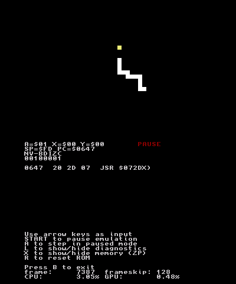

# 3ds-6502

MOS 6502 emulator for Nintendo 3DS. Runs the same binaries as 6502asm.com fantasy console.
The screen is 32x32 pixels starting from address $200, using a 16-color palette.

## how to run your own binaries
1. Compile binaries with [6502js](https://jborza.github.io/6502js/) - develop, assemble, click `binary`.
2. Copy the binary to SD card
3. Change the bin file name in `emu_3ds.c` - see function `load_bin`
4. Launch 3ds-6502.3dsx with homebrew launcher!

## build instructions
Run `make` with [devkitPro](https://devkitpro.org/) installed.

## screenshot
